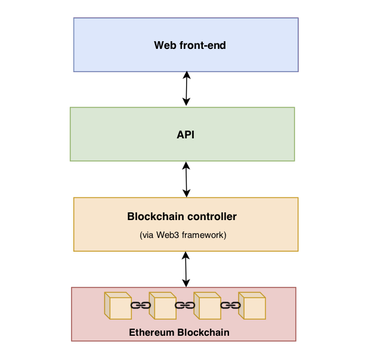
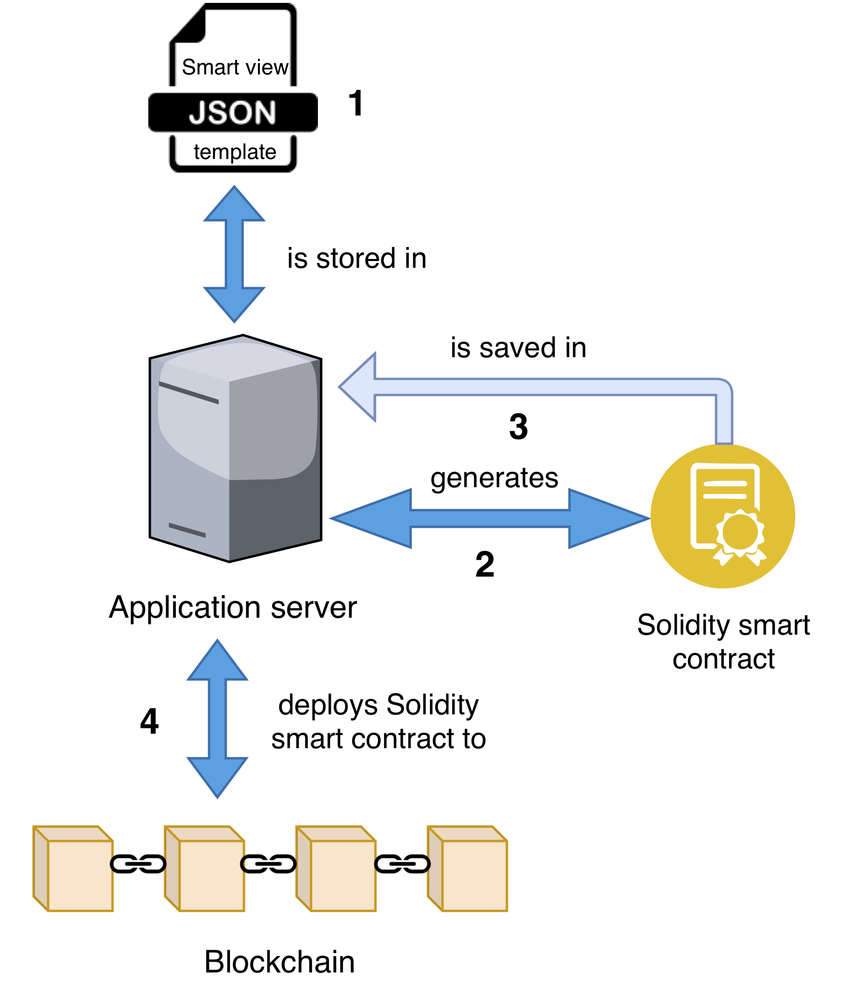
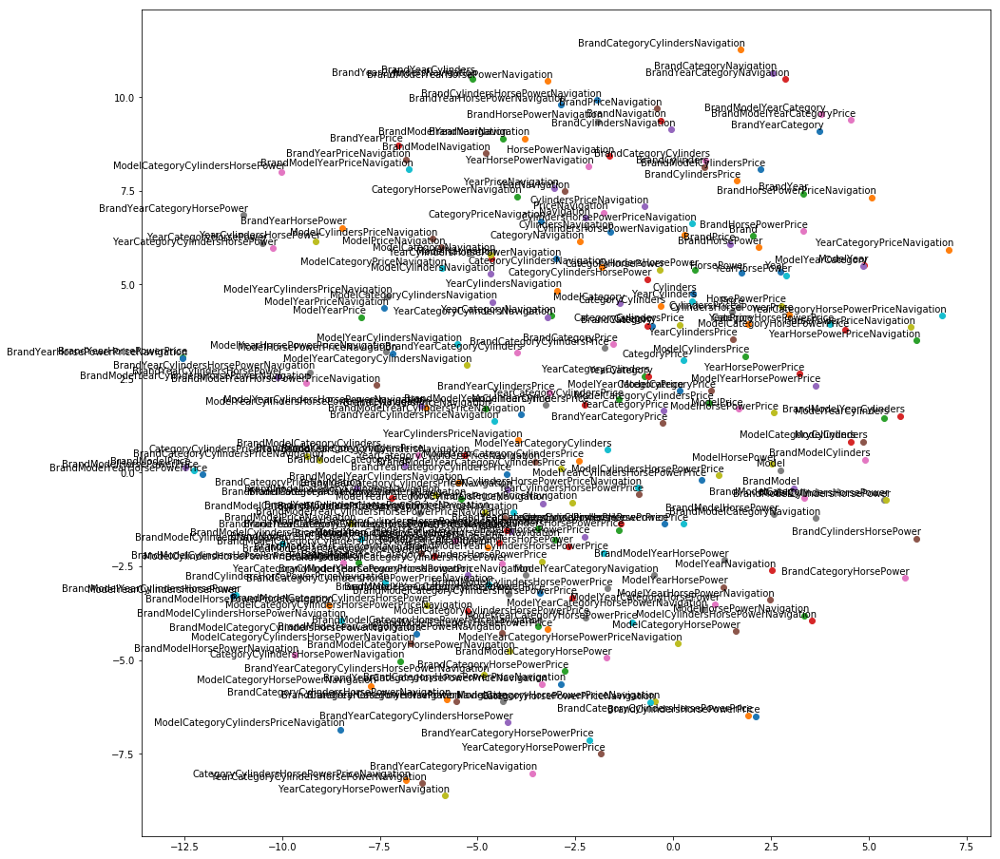
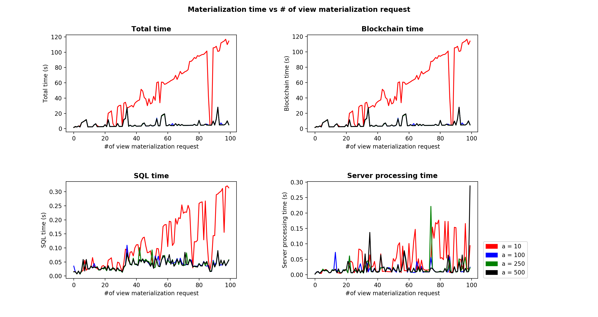

# Smart-Views: A blockchain enabled OLAP Data Warehouse
This repository hosts the application server of Smart-Views.
It is the implementation / application part of my thesis as an undergraduate Computer Science student of Athens University of Economics and Business ([aueb.gr](https://aueb.gr/))
under the supervision of Professor Yannis Kotidis.
 
The directory structure of the project is shown below.

The project is coded in **Node.JS** and uses the **Ethereum Blockchain** using the **Web3.JS** library.
```
├── README.md
├── config.json
├── config_lab.json
├── config_private.json
├── contracts
│   ├── ABCD.sol
│   └── Cars.sol
├── controllers
│   ├── cacheController.js
│   ├── computationsController.js
│   ├── contractController.js
│   └── viewMaterializationController.js
├── helpers
│   ├── contractDeployer.js
│   ├── contractGenerator.js
│   ├── costFunctions.js
│   ├── helper.js
│   └── transformations.js
├── index.js
├── package-lock.json
├── package.json
├── run.sh
├── schematics
│   ├── architecture.png
│   ├── deployment.png
│   ├── flow.png
│   └── structure.png
├── templates
│   ├── ABCD.json
│   └── cars.json
├── test
│   └── tests.js
├── test_scripts
│   ├── exp1.js
│   └── testDataGenerator.js
└── views
    ├── dashboard.ejs
    ├── form.ejs
    └── index.ejs

```
## Run instructions
After you clone the repo type ```npm install``` in the directory project and wait until all dependencies are installed. Then update th ```config.json``` file with the correct values for the fields ```redisPort```, ```redisIP```, ```blockchainIP``` and ```sql``` which are the most important ones in order to start the server.
The config file should look like this:
```
{
  "recordsSlice": 1000,
  "cacheEvictionPolicy": "FIFO",
  "maxCacheSize": 20,
  "cacheSlice": 400,
  "autoCacheSlice": "auto",
  "maxGbSize": 100,
  "redisPort": 6379,
  "redisIP": "127.0.0.1",
  "blockchainIP": "http://localhost:8545",
  "sql":  {
    "host": "localhost",
    "user": "sqlUser",
    "password": "yourPassword",
    "database": "yourDatabaseName"},
  "cacheEnabled": true
}
```
**Attention: mySQL database must be created by you and it must be empty.**
It is mandatory as the server uses SQL to do all the calculations for the Group Bys and the merging.

## Before running the server
Before you run the server you must do 3 things:

1) Start mySQL server if not running
2) Start the eththereum blockchain simulator (ganache-cli)
    * In order to do that, open a terminal window and type the command: ```ganache-cli -e 8000000000000 -l 80000000000000```. -e and -l parameters are set to those values in oder to be sure tht the emulator has sufficient funds for the transactions we will perform.
    Of course, in order to perform this action ```ganache-cli``` must be already installed. If you have not yet istalled ```ganache-cli``` you can do so by typing ```npm install ganache-cli -g```.
3) Start ```redis-server```.  You can do this by simply typing ```redis-server``` in a terminal window. Again, be sure to have ```redis-server``` installed before you perform this action.

Now you can type ```node index.js``` in the project root directory and if everything is fine, the server will start immediately.
If everything is set up correctly you should see the following lines in the terminal:
```
Smart-Views listening on http://localhost:3000/dashboard
Redis  connected
mySQL connected
``` 
**Alternatively you can simply run the ```run.sh``` script which starts Redis server, the Ethereum blockchain simulator (ganache-cli) and the application server at one.**
The run.sh script assumes mySQL server is already running, however you can simply add the command that starts mySQL server in th first line and automate that too.

# The project structure
The structure of the whole project is presented in the diagram.

It works as described below:
* **Blockchain** stores the raw data or what we call in data warehouses the "fact table". In our implementation we use Ethereum blockchain.

* **View cache** is an in-memory data store (often key-value based) that holds recently computed results of the smart views. In our implementation we use Redis cache

* **SQL Database** is used to execute the calculations and update the smart views. In our implementation we use mySQL server.

* **Application server** orchestrates the whole process of defining, storing, reusing and up- dating the smart views and fully controls the flow of data between the other components. 
<div ALIGN="center">

</div>


**The application server tries to materialize each smart view incrementally by using older cached versions of the same or other views.
In that way it avoids fetching many facts from the blockchain (which is the most time-intensive resource).**

# The application server structure
The server structure is shown in the diagram below.
The server communicates with the Ethereum blockchain via the "**Blockchain controller**". 
The blockchain controller contains the functions that call the methods of a deployed smart contract and it then passes the responses to the API level.
<div ALIGN="center">

</div>

# Templates, smart contracts generation and deployment
Templates are a key concept in the implementation of Smart views.
Templates are .json files describing each smart view. These files hold the metadata such as:
* the name of the structure / smart view
* the properties / columns of the fact table
* the necessary SQL queries for the computations
* the views that we want to define in the fact table and how frequently they have been materialized in the past

**We could say that templates are the Data Description Language (DDL) equivalent of our system.**

An example of a smart view template is shown below.

```
{
  "name": "CARS",
  "struct_Name": "Cars",
  "properties": [
    {
      "key": "payload",
      "data_type": "string"
    }
  ],
  "template": {
    "properties": [
      { "key": "pk" },
      { "key": "Brand" },
      { "key": "Model" },
      { "key": "Year" },
      { "key": "Category" },
      { "key": "Cylinders" },
      { "key": "HorsePower" },
      { "key": "Navigation" },
      { "key": "Price" }
    ],
    "create_table": "CREATE TEMPORARY TABLE CARS(\n\tpk int not null\n\t\tprimary key,\n\tbrand varchar(25),\n\tmodel varchar(25),\n\tyear int,\n\tcategory varchar(25),\n\tcylinders int,\n\tHorsePower int, \n\tNavigation varchar(25),Price numeric(8,2));\n\n",
    "table_name": "CARS"
  },
  "views": [
    {
      "name": "brand|category(COUNT)",
      "fields": [
        "brand",
        "category"
      ],
      "operation": "COUNT",
      "aggregationField": "pk",
      "SQLTable": "CREATE TEMPORARY TABLE tempTbl(brand varchar(25), cateogry varchar(25), COUNTpk int)",
      "frequency": 200
    },
    {
      "name": "brand|category|cylinders(COUNT)",
      "fields": [
        "brand",
        "category",
        "cylinders"
      ],
      "operation": "COUNT",
      "aggregationField": "pk",
      "SQLTable": "CREATE TEMPORARY TABLE tempTbl(brand varchar(25), cateogry varchar(25), cylinders int, COUNTpk int)",
      "frequency": 26
    },
    {
      "name": "brand(COUNT)",
      "fields": [
        "brand"
      ],
      "operation": "COUNT",
      "aggregationField": "pk",
      "SQLTable": "CREATE TEMPORARY TABLE tempTbl(brand varchar(25), COUNTpk int)",
      "frequency": 19
    }
  ]
}
``` 

Once the ```deploy``` method of the API is called for a template, the application server automatically generates a Solidity smart contract (saved under "contracts" directory).
If the template has the correct format and the smart contract generation do not throw an error, the application server continues by deploying the generated smart contract to the Ethereum blockchain.
The whole process is described in the diagram below.

<div ALIGN="center">

</div>

# Smart-View materialization process

The flowchart below presents the materialization process that takes place when the user requests a Smart-View.

<div ALIGN="center">

</div>

# Cached results evaluation process
When a Smart-View is requested, the application server fetches the metadata stored for each previous cached result from the Blockchain which acts as our permanent storage.
Then, it filters out the cached results that are not useful for the materialization of the view requested. 
These cached results are the ones that contain more and / or other fields than the fields of the requested view.

**As a general rule, the cached results that can be used for the materialization of a requested view are the ones that their fields are a superset of the fields of the requested view and they also have the same aggregate function.**

i.e Let's assume we have the previous stored results in cache of the views ```{Brand, Category, Cylinders}``` and ```{Year, Model, Brand}``` for the ```COUNT``` aggregate function.
If the next view requested by the user is the ```{Brand, Category}``` view for the ```COUNT``` aggregate function, then the ```{Year, Model, Brand}``` cached result will be eliminated as it does not contain each and every field of the requested view.
Application server will use the previous cached result for the view ```{Brand, Category, Cylinders}``` in order to materialize the view incrementally as it can reduce it to the requested view by summing the aggregate function values of the previous cached result.

During the evaluation process of the optimal cached result for the fastest materialization of the view, 2 different policies may apply:
Note: this policy is set in the ```calculationCostFunction``` field of our ```config.json``` file.

1) **A Cost Function**

Let &nbsp;  be the moment where a previous cached result has been calculated for a view &nbsp;.
Then &nbsp;  are the records written in blockchain after the time &nbsp; .

Let &nbsp; &nbsp; to be the size of the latest cached result of view &nbsp; and 
&nbsp; the size of the deltas respectively. 
The merge operation of the cached result and the deltas are actually an aggregate SQL statement over these data.
Aggregations are typically computed in linear complexity by the SQL backend.

Thus we can estimate the cost of the merge as 
<div ALIGN="center">
.
</div>

The cost of deltas retrieval from the blockchain (which is the most time intensive resource) is estimated as 


In total, the cost of using smart view  in order to materialize view  is estimated as 
<div ALIGN="center">

</div>

This can be written as
<div ALIGN="center">

</div>
or
<div ALIGN="center">

</div>

<p>
Constants  and 
denote the relative costs of post- aggregating cached results with delta records and retrieving data from the blockchain, respectively.
</p>
<p>
In most implementations we expect &nbsp; .
</p>
Thus, for the purpose of ranking the views Vi and selecting the top candidate for materializing view V the cost formula can be simplified as:
<div ALIGN="center">

</div>

Where &nbsp; is the cost of materializing view V using the latest cached result of a view Vi (always assuming that )
for some constant  .

In that way application server sorts all the cached results based on that function and picks the best one (the one with the less cost).  

2) **Query2Vec model**

Inspired by the original **Word2Vec model** that is a very commonly used algorithm in Natural Language Processing, Query2Vec takes as an input the views that have been requested by users in the past.
As Word2Vec model uses two-layer neural networks that try to "guess" the linguistic and semantic context of the words, Query2Vec model is trained to "guess" which views may be requested within similar context.
 
**Assuming we have recorded the views and the order with which these have been requested by the users of our system, Query2Vec produces a vector space of the views that can be materialized by our system.
Each view requested in the past is represented by a vector in this space.
View vectors are positioned in the space in a way that views that have been requested at adjacent time and context are located close to one another.**
In that way, we can then sort the cached results based on their **similarity** (Euclidean or cosine) with the requested view and then pick the most similar.

The following graph shows the position of 252 different views of the cars dataset.
The vectors/embeddings have been generated after the training of the model in a corpus of 4.000 different view materializations requested previously.

PCA to 2 dimensions has been performed for visualisation purposes.
 
<div ALIGN="center">  </div>


Smart-Views use [gensim library](https://radimrehurek.com/gensim/) for the Word2Vec model implementation and training using skipgram algorithm.
You can see [word2vec_train.py](word2vec_train.py) script for more information about the models and its parameters.

# Optimizing the cost function

As we mentioned above, the cost function we use to rank and select a previous cached result in order to materialize a view requested, contains the factor &nbsp;
.
We run the following experiment with 4 different values of   in order to estimate the optimal value.

**The experiment**

The experiment is the repeated insertion of 100 records in our system followed by the materialization request for a view. We preformed 100 iterations for every value of .

The sequence of the views requested was the same for all the iterations and it was randomly generated, the records were randomly generated too.

The experiment was performed using the [ABCDE template](templates/ABCDE.json) wchich contains 5 integer fields (A,B,C,D and E).

You can see the records used in [test_data/benchamarks](test_data/benchmarks) and the sequence of the views requested in [test_scripts/EXPViewSequence.txt](test_scripts/EXPViewSequence.txt) file.

We performed the experiment for &nbsp;  &nbsp; and we got the following results concerning the materialization time.
The results are the mean values of all iterations we performed for each value of .


<div ALIGN="center">
<table>
<thead>
<tr>
<th>  </th>
<th>10</th>
<th>100</th>
<th>250</th>
<th>500</th>
</tr>
<tr>
<td>Total Time (s)</td>
<td>47.58</td>
<td>5.81</td>
<td>5.70</td>
<td>5.80</td>
</tr>
<tr>
<td>Blockchain Time (s)</td>
<td>47.34</td>
<td>5.68</td>
<td>5.57</td>
<td>5.67</td>
</tr>
<tr>
<td>SQL Processing Time (s)</td>
<td>0.11</td>
<td>0.04</td>
<td>0.04</td>
<td>0.04</td>
</tr>
<tr>
<td>Application server processing Time (s)</td>
<td>0.04</td>
<td>0.01</td>
<td>0.01</td>
<td>0.02</td>
</tr>
</thead>
</table>
</div>

The following plot may describe better the behavior of the cost function for the different values of .



It seems that we have a clear "loser". 
10 seems to be very small value for  and it does not lead the function to sort the cached results in a way that the optimal one will be selected.
However, values larger than 100 do not seem to offer any better result in terms of materialization time.

# The Code
The back-end code is separated in 4 main categories.
1) **Helper functions** (in "helpers" directory)
2) **Controllers** (in "controllers" directory) that represent the level between the API an the other services that the project uses (Ethereum blockchain, mySQL server and Redis cache).
Controllers contain one more file, the "viewMaterializationController.js". It represents a level of abstraction between the service controllers and the API. It is responsible for the business logic and the implementation of each materialization logic.
It contains the functions the the API finally calls when a view is requested by the user.
3) **Smart contracts**, which are the Solidity contracts running over Ethereum blockchain (in "contracts" directory) and they are auto generated by the application server as we mentioned above.
4) **The API** (in "index.js" file) that we use to call smart contract and view materialization methods.


The front-end code is much simpler and it is located under "views" directory. 
It contains the .ejs templates for the pages we use to call the API functions in a more user-friendly way.

# Tests
Test have been written for most of the functionality of the project and they are located in ```tests.js``` file.
You can run them by executing ```npm test```.
Tests are written with Mocha.js and Chai.js libraries.
